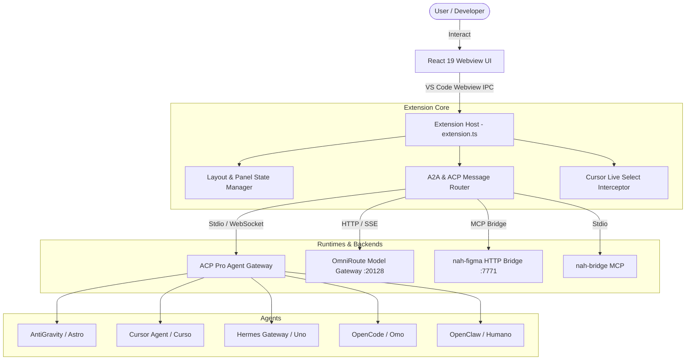

# Agent Workbench — System Architecture

## Technical Stack
- **Frontend**: React 19, TypeScript, Tailwind CSS, `lucide-react`, `react-resizable-panels`.
- **Bundler**: `esbuild` with incremental fast-build watch mode.
- **IPC Layer**: VS Code Webview Message Passing + native WebSocket client.
- **State Persistence**: `vscode.ExtensionContext.workspaceState` and `globalState`.
- **Packaging**: `@vscode/vsce` -> `.vsix`.
